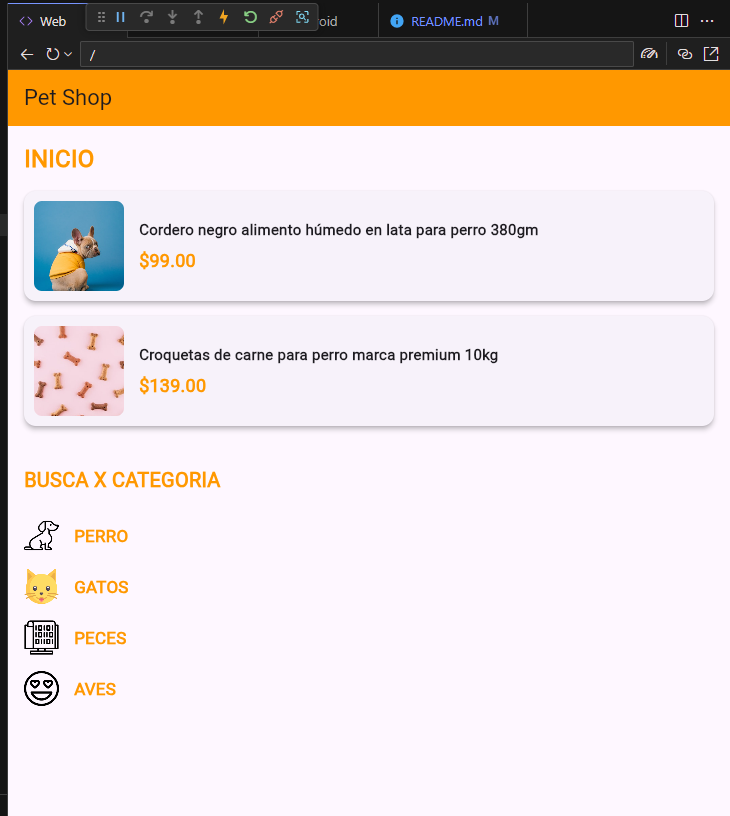
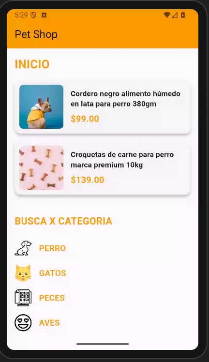

# myapp

 lenguaje dart flutter, nivel principiante,de inicio pon como titulo arriba de la columna en color naranja "inicio" una columna de 2 filas y, en cada fila una tarjeta(card), en cada tarjeta (una imagen desde la red a la izquierda relacionada a los alimentos de mascota, a la derecha una columna con 2 filas y en la primer fila  un titulo, en la segunda fila un subtitulo, los textos alineados al a izquierda) para la primer fila pon como titulo ("cordero negro alimento humedo en lata para perro 380gm" y de subtitulo en un color naranja "$99.00"), para la segunda fila (de titulo pon "croquetas de carne para perro marca premium 10kg" y de subtitulo de color naranja "$139.00")la tarjeta con sombreado , utilizar colores atractivos desde la red, crear la clase productos, con los atributos (titulo, subtitulo y img_url), en la siguiente parte abajo de la segunda fila pon otro titulo en naranja como "busca x categoria" abajo del titulo crea otra columna con 4 filas, a cada fila en el lado izquirdo ponle una imagen desde la red, a la primer fila en un titulo color naranja como "perro", la segunda fila pon como titulo en naranja "gatos", en la tercer fila pon como titulo en narajna"peces" y en la cuarta fila pon como titulo en color naranja "aves" en cada fila pon como imagen un icono. crear una lista de diccionarios por cada tarjeta . proporciona el codigo correspondiente en un solo archivo.

# 
# 

